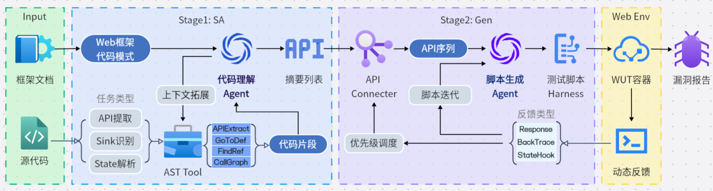

# WFG - WebFuzz生成框架

WebFuzzGen 是以测试脚本生成为核心的通用Web应用漏洞挖掘 Agent 框架。



## 项目流程

### Stage1: 静态分析 (SA)

### Stage2: 脚本生成 (Gen)

### Stage3: 动态测试 (DF)

## 运行方法

### 环境配置

本项目使用 `uv` 进行环境和依赖管理。

### 启动命令

```bash
uv run python src/main.py -p <your_project_path> sa
```
