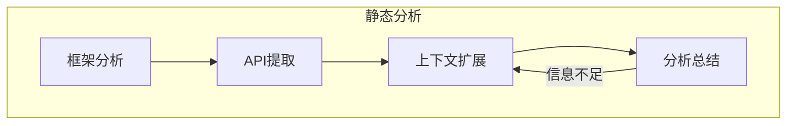

# WFG - WebFuzz生成框架

WebFuzzGen 是基于测试脚本生成的通用WebFuzz框架。

## 项目流程

### 静态分析 (SA)



## 运行方法

### 环境配置

本项目使用 `uv` 进行环境和依赖管理。

### 启动命令

```bash
uv run python src/main.py -p <your_project_path> sa
```
